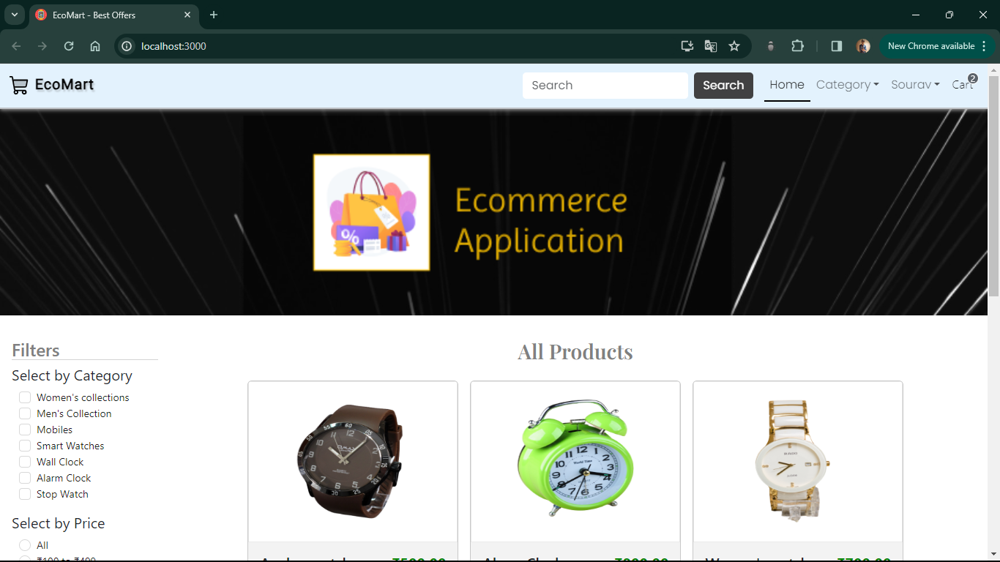
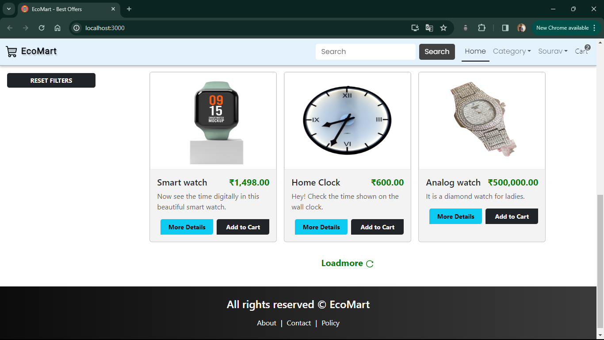
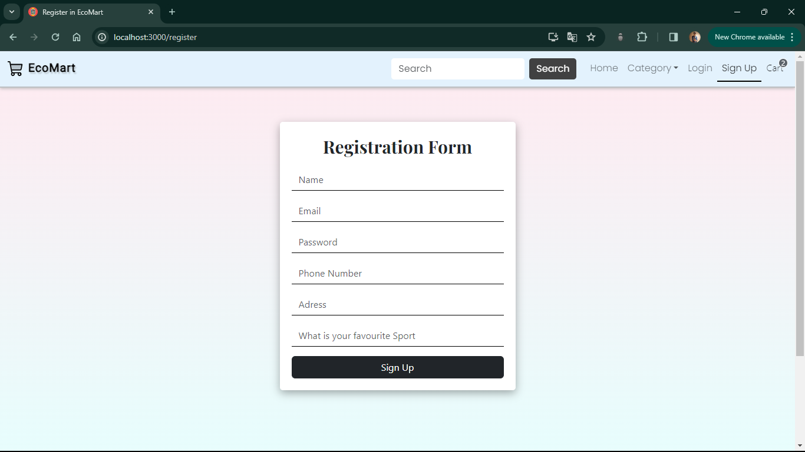
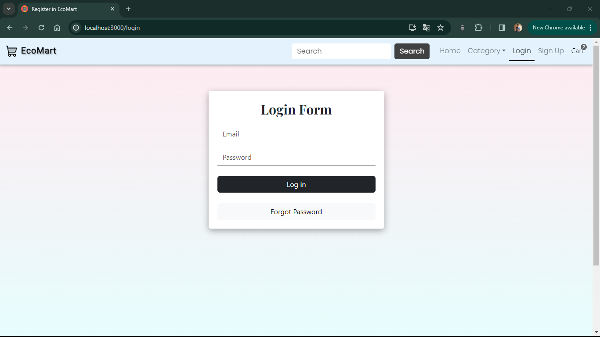

# 🛒 **EcoMart**

EcoMart is a full-stack e-commerce website built using the MERN (MongoDB, Express.js, React.js, Node.js) stack. It utilizes MongoDB for data management, and Express.js for handling HTTP requests. EcoMart enables users to browse and purchase a wide range of products across various categories, with its user-friendly interface and secure payment processing. Experience the convenience of e-commerce with EcoMart today! 🛒🌐

### The site is currently running at [https://perfect-pear-yoke.cyclic.app/](https://perfect-pear-yoke.cyclic.app/)

## 📸 Some Clips

#### Home Page <br/>

  <br/>

#### Register & Login <br/>

  <br/>

#### Cart, User Dashboard and Admin panel <br/>

  <br/>

## 🚀 Features

- **🔐 User Authentication:**  Users can register and log in. Passwords are hashed for security. JWT tokens are issued upon successful login for subsequent authenticated requests.
- **🔍 Search**:  Allows users to search for products.
- **🛍️ Product Listing:**  Products are listed with their name, price, and photo. Users can filter and sort the product list according to category and price.
- **🛒 Shopping Cart:**  Users can add products to their shopping cart and view the contents of their cart.
- **📝 Order Processing:**  Users can place an order and view their order history.
- **👥 User Dashboard**:  Allows users to view their profile and orders. User can edit their profile also.
- **👤 Admin Dashboard:**  Allows admins to manage categories, products, and orders.
- **🗄️ Forgot Password**:  Allows users to reset their password if they forget it.
- **💳 Payment Processing:**  Integrated Braintree payment gateway for secure and seamless online transactions. 
- **📱 Responsive Design:**  The application is responsive and optimized for various screen sizes.

## 🛠️ Technologies Used

### 💻 Frontend

- [React](https://reactjs.org/) - JavaScript library for building user interfaces.
- [React Router DOM](https://reactrouter.com/web/guides/quick-start) - The standard routing library for React
- [Axios](https://axios-http.com/) - Promise-based HTTP client for making API requests.
- [Bootstrap](https://getbootstrap.com/) - CSS framework for building responsive and mobile-first websites.
- [Ant Design](https://ant.design/) - A design system with values of Nature and Determinacy for better user experience of enterprise applications
- [Braintree Web Drop-in React](https://www.npmjs.com/package/braintree-web-drop-in-react) - A pre-built UI for Braintree's Drop-in
- [React Helmet](https://www.npmjs.com/package/react-helmet) - A document head manager for React
- [React Hot Toast](https://react-hot-toast.com/) - Smoking hot notifications for React

### 🌐 Backend

- [Node.js](https://nodejs.org/) - JavaScript runtime for building server-side applications.
- [Express](https://expressjs.com/) - Web application framework for Node.js for building APIs.
- [MongoDB](https://mongodb.com/) - NoSQL database for storing product and user data.
- [Bcrypt](https://www.npmjs.com/package/bcrypt) - A library to help you hash passwords
- [Mongoose](https://mongoosejs.com/) - Elegant mongodb object modeling for node.js
- [Jsonwebtoken](https://www.npmjs.com/package/jsonwebtoken) - An implementation of JSON Web Tokens
- [Dotenv](https://www.npmjs.com/package/dotenv) - A zero-dependency module that loads environment variables from a `.env` file into `process.env`
- [Cors](https://www.npmjs.com/package/cors) - Package for providing a Connect/Express middleware that can be used to enable CORS with various options
- [Morgan](https://www.npmjs.com/package/morgan) - HTTP request logger middleware for node.js
- [Braintree](https://www.npmjs.com/package/braintree) - A Node.js library for integrating with the Braintree Gateway
- [Express Formidable](https://www.npmjs.com/package/express-formidable) - A Node.js module for parsing form data, especially file uploads

## 🏁 Getting Started

These instructions will get you a copy of the project up and running on your local machine for development and testing purposes.

### 📋 Prerequisites

Before you begin, ensure you have met the following requirements:

- 🖥️ You have a recent version of **Node.js** installed. If not, you can download it from [here](https://nodejs.org/)
- 🧰 You have a package manager like **npm** (comes with Node.js) or **yarn** installed.
- 🛠️ You have **Git** installed. If not, you can download it from [here](https://git-scm.com/downloads)

## 🛠️ Installation & Set Up

1. 🔽 Clone the repository:

   ```bash
   git clone https://github.com/Sourav-Ghorai/EcoMart.git
   ```

2. 📂 Navigate into the directory:

   ```bash
   cd EcoMart
   ```

3. 🌐 Install the dependencies:

   ```bash
   npm install
   ```

4. 🌿 Create a .env file in the root directory and configure environment variables such as MongoDB URI, JWT secret, Braintree credentials, etc.

   ```bash
   cp .env.example .env
   ```

   Open `.env` and replace the placeholders with your actual data.

## 🚀 Running the Application

After installing the dependencies, you can run the application using the following scripts defined in the `package.json` file:

-   To run the application in development mode, use:
    ```bash
    npm run dev
    ```
-   To start the application normally, use:
    ```bash
    npm start
    ```

Access the Application:

   Open your browser and navigate to http://localhost:3000 to access the EcoMart application.

## Contribution
Contributions are welcome! If you'd like to contribute to EcoMart, feel free to fork the repository, make your changes, and submit a pull request. Make sure to follow the project's coding guidelines and conventions.

**Thank you for choosing EcoMart! Happy shopping! 🌿🛒**